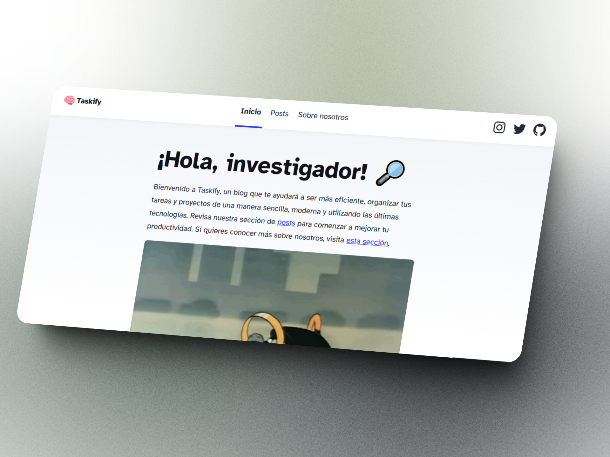
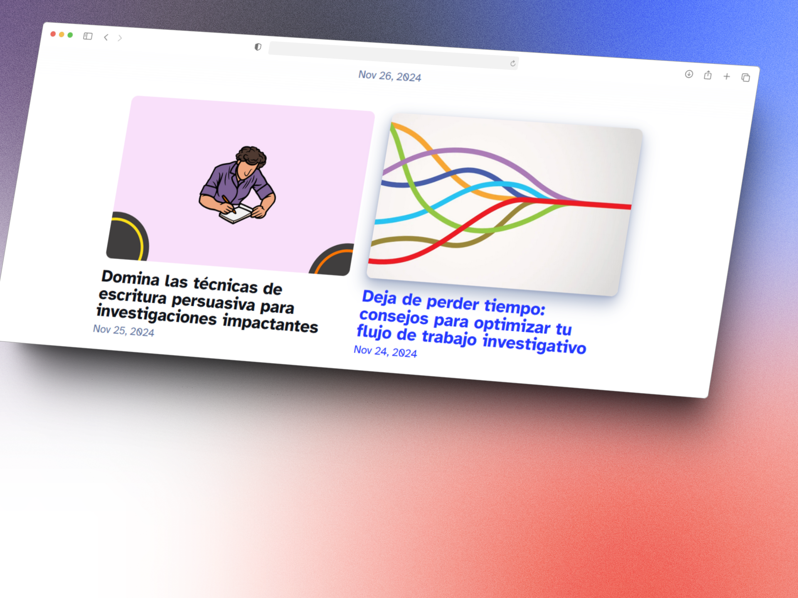

# Taskify

Welcome to **Taskify**, your go-to blog for improving productivity and organizing tasks efficiently! 🚀

## Overview

**Taskify** is a blog designed to help researchers, students, and professionals stay organized, boost productivity, and make their workflows more efficient. By combining actionable advice with modern tools and technologies, Taskify provides the insights needed to manage tasks, projects, and daily activities like a pro.

This blog was created using a template by [Maxi Ferreira](https://github.com/charca), who has contributed a clean, fast, and SEO-optimized base template.

## Screenshots

## Usage

To start using Taskify, simply [visit the website](https://tu-sitio.com) and dive into our articles designed to help you improve your productivity and research processes.

## Feedback

We value your feedback! If you have suggestions or encounter any issues, feel free to [open an issue](https://github.com/StevenTete/taskify/issues) on our GitHub repository.

## License

Taskify is licensed under the [MIT License](https://opensource.org/licenses/MIT). Feel free to fork, modify, and share!

---

*Taskify - Streamline Your Workflow, Boost Your Productivity.*
